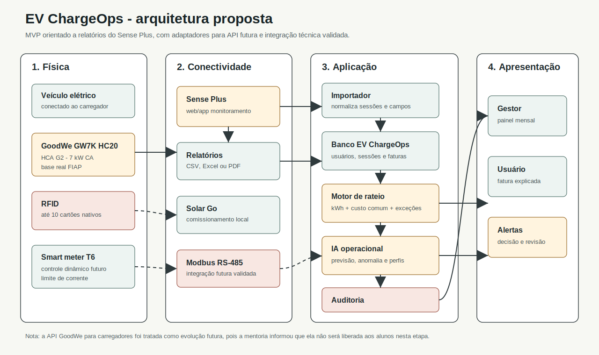

# Enterprise Challenge 2026 - GoodWe + FIAP

Projeto da Sprint 01 do Enterprise Challenge 2026, Fase 4 - Energia para sobreviver.

O objetivo desta sprint é pesquisar, documentar e propor a base da solução **EV ChargeOps**, termo usado no enunciado do desafio para representar uma plataforma capaz de transformar sessões de recarga de veículos elétricos em dados estruturados, rateio justo e inteligência operacional.

## Equipe

**Equipe 01**

| Integrante | RM | E-mail |
| --- | --- | --- |
| Danilo Gustavo da Silva Fernandes | RM570057 | rm570057@fiap.com.br |
| Renan Mano Otero | RM573615 |
| Beatriz Marques Souza | RM571819 |

## Resumo da Solução

O EV ChargeOps é proposto como uma camada de gestão para recarga compartilhada em condomínios, edifícios corporativos e campus universitários.

No cenário real da FIAP/GoodWe, o carregador usado como referência é o **GoodWe GW7K HC20**, linha **HCA G2**, de **7 kW em corrente alternada**, monitorado pela plataforma **Sense Plus**. A mentoria técnica esclareceu pontos decisivos:

- a API para carregadores ainda está em desenvolvimento e não será liberada aos alunos nesta etapa;
- o carregador usa **Modbus**, não OCPP;
- o Sense Plus é a principal fonte prática para visualizar histórico, potência, energia, status e relatórios;
- não há cobrança automática integrada;
- o carregador suporta até 10 cartões RFID, o que cria limite de escala para condomínios maiores.

Por isso, a proposta não depende de uma API indisponível. O MVP da Sprint 2 deve importar relatórios do Sense Plus ou arquivos simulados no mesmo formato, normalizar sessões, associar RFID a usuários/unidades, calcular rateio e gerar alertas operacionais.

## Problema

Quando um carregador é usado por várias pessoas, a operação deixa de ser apenas técnica e vira uma rotina administrativa:

- quem usou o carregador?
- quanto consumiu?
- qual regra de cobrança foi aplicada?
- como tratar falha, sessão interrompida ou ociosidade?
- como o síndico ou gestor comprova que o rateio foi justo?
- como prever picos e decidir se vale instalar novos carregadores?

Sem dados organizados, a recarga compartilhada pode gerar conflito, cobrança injusta e baixa confiança dos usuários. O EV ChargeOps resolve esse espaço entre o carregador e a gestão financeira/operacional.

## Frente 1 - Contexto e Problema

Arquivo completo: `docs/pesquisa/contexto-problema.md`

A Frente 1 documenta:

- o que é infraestrutura de recarga compartilhada;
- desafios de condomínios, empresas e campus;
- como uma sessão de recarga gera dados;
- modelos de negócio: gratuidade, cobrança por kWh, cobrança por tempo, assinatura e rateio condominial;
- benchmark de mercado.

**Aprofundamento escolhido:** Opção A - Análise de mercado.

Foram analisadas NeoCharge, Zaptec Pro, Wallbox Pulsar Plus e GoodWe HCA G2 + Sense Plus. A conclusão é que o EV ChargeOps não deve tentar ser apenas mais um aplicativo de carregador. Seu diferencial deve ser o **rateio auditável a partir de dados de sessão**, com inteligência operacional para gestores.

Artefatos:

- `data/benchmark-solucoes-recarga.csv`
- `assets/diagrams/fluxo-sessao-recarga.svg`
- `docs/revisao-senior-topico-1.md`

## Frente 2 - Base Regulatória e Técnica

Arquivo completo: `docs/pesquisa/base-regulatoria-tecnica.md`

A Frente 2 documenta:

- recorte da Resolução Normativa ANEEL nº 1.000/2021 indicado pelo enunciado;
- exploração comercial da recarga;
- comunicação prévia à distribuidora;
- atenção a protocolos abertos para equipamentos não exclusivos de uso privado;
- interfaces GoodWe HCA G2: RS-485/Modbus, LAN, Wi-Fi, Bluetooth, RFID, Sense Plus e Solar Go;
- diferença entre o que o enunciado pede sobre API GoodWe/SEMS e o que a mentoria esclareceu sobre indisponibilidade da API para os alunos.

**Aprofundamento escolhido:** Opção C - APIs complementares.

APIs mapeadas:

| API | Uso no EV ChargeOps |
| --- | --- |
| Open Charge Map API | Mapear estações próximas, comparar infraestrutura e entender maturidade de recarga no entorno. |
| Google Places API - `evChargeOptions` | Enriquecer informações de pontos de recarga, conectores e disponibilidade quando houver dados. |
| ANEEL Open Data | Apoiar simulações tarifárias, dados de distribuidoras e cálculo parametrizável de custo por kWh. |
| IBGE Localidades API | Padronizar cidade, UF e região para cadastro e expansão futura. |

Decisão técnica desta frente:

> O MVP deve usar importação de relatórios do Sense Plus e manter adaptadores preparados para API GoodWe futura, Modbus validado ou outras fontes.

## Frente 3 - Arquitetura e IA

Arquivo completo: `docs/pesquisa/arquitetura-ia.md`

A Frente 3 define a solução em quatro camadas:

| Camada | Função |
| --- | --- |
| Física | Carregador GoodWe, veículo, RFID, rede elétrica e smart meter futuro. |
| Conectividade | Sense Plus, Solar Go, Wi-Fi, LAN, Modbus e exportação de relatórios. |
| Aplicação | Importador, banco de dados, motor de rateio, IA e auditoria. |
| Apresentação | Painel do gestor, fatura do usuário, alertas e recomendações. |

**Aprofundamentos escolhidos:** Opção B - Papel da IA e Opção C - Esquema da base de dados. Também foi incluído benchmark de modelos de rateio para fortalecer a decisão.

## Diagrama de Arquitetura



## Fluxo da Sessão até a Fatura

1. Usuário conecta o veículo e inicia a recarga.
2. Carregador GoodWe registra energia, duração, potência, status e eventos.
3. Sense Plus exibe o histórico e, conforme acesso disponível, permite exportação de relatórios.
4. EV ChargeOps importa o relatório.
5. O sistema normaliza campos, associa RFID a usuário/unidade e valida inconsistências.
6. Regras e IA sinalizam sessões suspeitas.
7. Motor de rateio calcula consumo individual, custos comuns, ociosidade e ajustes.
8. Gestor recebe painel mensal e usuário recebe fatura explicada.

## Modelo de Rateio

O modelo adotado é híbrido:

- consumo individual por kWh medido;
- custo comum separado e transparente;
- penalidade de ociosidade apenas após tolerância;
- tratamento manual auditável para exceções.

Fórmula base:

```text
consumo_usuario_mes_kwh = soma(kWh das sessões válidas do usuário no mês)

custo_energia_usuario = consumo_usuario_mes_kwh * tarifa_kwh_aplicada

custo_comum_usuario = custo_comum_mensal * regra_rateio_comum

penalidade_ociosidade = max(0, minutos_ociosos - franquia_ociosidade) * tarifa_ociosidade_minuto

ajustes = créditos - débitos validados pelo gestor

fatura_usuario = custo_energia_usuario
                + custo_comum_usuario
                + penalidade_ociosidade
                + ajustes
```

Casos excepcionais:

| Caso | Tratamento |
| --- | --- |
| Sessão interrompida | Cobrar apenas kWh entregue e marcar revisão se houver falha. |
| Usuário sem recarga no mês | Não cobrar consumo variável; custo comum depende da regra do condomínio. |
| Dois veículos da mesma unidade | Agregar por unidade e manter histórico separado por RFID/veículo. |
| RFID sem usuário vinculado | Bloquear faturamento automático e enviar para conciliação. |
| kWh zero com longa duração | Não cobrar energia e sinalizar possível falha ou ociosidade. |

## Papel da IA

A IA é estrutural porque atua antes e depois do rateio:

| Abordagem | Problema que resolve | Dados necessários | Impacto esperado |
| --- | --- | --- | --- |
| Previsão de consumo e pico | Gestor não sabe quando haverá maior demanda. | Data, hora, kWh, duração, potência, usuário e status. | Planejar expansão, agenda e controle de demanda. |
| Detecção de anomalias | Sessões podem ter erro, falha ou comportamento fora do padrão. | kWh, duração, potência média, RFID, status e histórico. | Evitar cobrança errada e acionar revisão. |
| Agrupamento de perfis | Usuários têm padrões de uso diferentes. | Consumo mensal, frequência, duração média e horário preferido. | Criar regras, comunicação e planos mais justos. |

Técnicas sugeridas para Sprint 2:

- regressão linear ou estatística simples para previsão inicial;
- `IsolationForest` ou regras determinísticas para anomalias;
- `KMeans` para perfis de uso quando houver histórico suficiente.

## Esquema de Dados

Entidades principais:

- `usuario`
- `unidade`
- `veiculo`
- `carregador`
- `rfid_credencial`
- `relatorio_importado`
- `sessao_recarga`
- `tarifa`
- `regra_rateio`
- `fatura`
- `item_fatura`
- `alerta_ia`
- `auditoria_evento`

Dados simulados para orientar a Sprint 2:

- `data/exemplo-sessoes-sense-plus.csv`
- `data/dicionario-campos-sessoes.csv`

Esses arquivos não representam dados reais da FIAP. Eles servem para desenvolver e testar importação, validação, rateio e IA sem expor dados operacionais.

## Plano da Sprint 2

| Ordem | Entrega | Tecnologias sugeridas | Resultado esperado |
| --- | --- | --- | --- |
| 1 | Modelagem do domínio | Python, Pydantic ou dataclasses, SQLite/PostgreSQL | Entidades e relacionamentos implementados. |
| 2 | Importador de relatórios | Python, pandas, openpyxl, leitura CSV inicial | Sessões carregadas e validadas. |
| 3 | Motor de rateio | Python, pytest | Faturas calculadas com testes de exceção. |
| 4 | Painel mínimo | Streamlit ou FastAPI + front-end simples | Gestor visualiza sessões, rateio e alertas. |
| 5 | IA operacional | scikit-learn, pandas | Previsão, anomalia e perfis demonstráveis. |
| 6 | Evidência e pitch | README, prints, vídeo de 3 minutos | Fluxo completo demonstrado para avaliação. |

## Forma de Entrega

A Sprint 01 deve ser entregue na plataforma **FIAP ON** como um arquivo `.TXT` contendo o link do repositório do grupo.

O repositório deve conter este README como documento central e os arquivos de apoio em `docs/`, `data/`, `assets/diagrams/` e `references/`.

Prazo informado no enunciado local: **21 de junho de 2026, às 23h59**.

## Estrutura do Projeto

```text
enterprise-challenge-goodwe/
  assets/
    diagrams/
      arquitetura-ev-chargeops.mmd
      arquitetura-ev-chargeops.svg
      fluxo-sessao-recarga.mmd
      fluxo-sessao-recarga.svg
  data/
    benchmark-solucoes-recarga.csv
    dicionario-campos-sessoes.csv
    exemplo-sessoes-sense-plus.csv
  docs/
    pesquisa/
      arquitetura-ia.md
      base-regulatoria-tecnica.md
      contexto-problema.md
    revisao-senior-topico-1.md
  references/
    fontes.md
  README.md
```

## Fontes

As fontes verificadas estão registradas em `references/fontes.md`.

Principais bases consultadas:

- enunciado oficial local da FIAP;
- transcript local da mentoria GoodWe/FIAP;
- ABVE;
- Open Charge Alliance;
- Open Charge Map;
- Google Places API;
- ANEEL Open Data;
- IBGE Localidades API;
- documentação scikit-learn.
