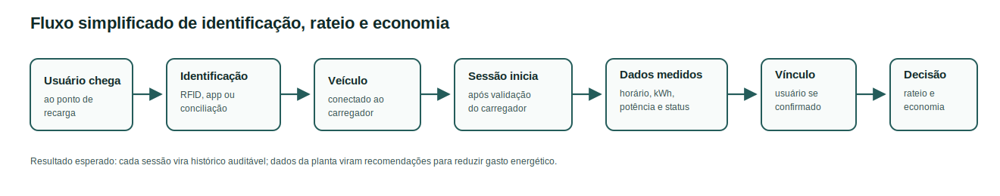

# Frente 1 - Contexto e Problema

## Objetivo desta Frente

Esta frente explica, em linguagem clara, o problema que o EV ChargeOps precisa resolver. O nome EV ChargeOps aparece no enunciado do desafio como a solução proposta para transformar sessões de recarga de veículos elétricos e dados energéticos do local em governança, rateio justo e inteligência acionável.

Na prática, o problema é simples de entender: quando um condomínio, uma empresa ou uma faculdade instala um carregador compartilhado, várias pessoas passam a usar o mesmo equipamento. Isso ajuda a reduzir custos de instalação e amplia o acesso à recarga, mas cria uma pergunta operacional importante:

> Como saber quem usou o carregador, quanto consumiu, quanto deve pagar e quais decisões podem reduzir o gasto energético do local?

Sem registro organizado, a recarga compartilhada pode virar uma fonte de conflito e desperdício. O gestor pode não saber quanto cada usuário consumiu, o morador pode não confiar no valor cobrado e o condomínio pode ter dificuldade para identificar horários de pico, ociosidade, falhas, uso abusivo ou oportunidades de economia, como deslocar recargas para horários melhores, aproveitar geração solar ou estudar expansão fotovoltaica.

Esse problema ficou mais relevante porque a eletromobilidade deixou de ser um assunto distante. Segundo dados divulgados pela ABVE em junho de 2026, o Brasil emplacou 44.981 veículos leves eletrificados em maio de 2026, e esse grupo chegou a 17% de participação nas vendas domésticas de automóveis e comerciais leves no mês. Ou seja, quanto mais veículos eletrificados entram em circulação, maior tende a ser a pressão por recarga em condomínios, empresas e estacionamentos compartilhados.

## Recorte Real do Desafio GoodWe/FIAP

A mentoria de alinhamento deixou o problema mais concreto. O projeto não deve imaginar um carregador genérico com uma API pronta, pagamento automático e integração livre com qualquer sistema. O cenário real parte do carregador instalado na FIAP, modelo **GW7K HC20**, da linha **HCA G2**, com potência nominal de **7 kW em corrente alternada (CA)**.

Esse carregador é monitorado pelo ecossistema **SEMS/Sense Plus**, que permite visualizar energia, potência, status, modo de operação e relatórios conforme o acesso. A call também esclareceu uma restrição importante: **não haverá API pública liberada para os alunos nesta etapa**. Portanto, o caminho mais realista para a Sprint 1 é trabalhar com dados exportados ou consultados no SEMS/Sense Plus, mas sem assumir que a versão web já entregue sessões do carregador por usuário/RFID.

Outro ponto relevante é que o carregador usa **Modbus**, não OCPP. Isso muda a forma de pensar a solução: não dá para assumir, nesta sprint, uma integração pronta com plataformas abertas de cobrança ou operação de eletropostos. O MVP precisa nascer respeitando essa limitação, usando dados disponíveis do SEMS/Sense Plus e sessões reais somente quando confirmadas, além de propor uma camada própria de organização, rateio e análise.

Em resumo, o problema da equipe não é "criar um app bonito para carregar carro". O problema é pegar os dados reais disponíveis na operação GoodWe/FIAP e transformá-los em:

- identificação de uso por sessão;
- cálculo de consumo por usuário ou cartão RFID;
- base para cobrança ou rateio;
- leitura de falhas e sessões interrompidas;
- relatório compreensível para gestor e usuário;
- recomendações para operação, economia de energia e expansão da infraestrutura.

Com a validação do SEMS Portal, essa proposta ficou mais interessante: os dados agregados de planta não bastam para cobrar um usuário individual, mas servem muito bem para analisar geração, consumo, rede, bateria, picos e oportunidades de economia local. Portanto, a solução deve juntar duas visões: **quem usou a recarga** e **como o local pode gastar menos energia para operar essa recarga**.

## O que é Recarga Compartilhada

Recarga compartilhada é o uso de uma mesma infraestrutura de carregamento por mais de um usuário. Em vez de cada pessoa instalar um carregador próprio, o local oferece um ou mais pontos de recarga de uso comum.

Esse cenário aparece principalmente em:

- **Condomínios residenciais:** moradores usam carregadores instalados em vagas comuns, vagas rotativas ou áreas compartilhadas.
- **Edifícios corporativos:** funcionários, visitantes, clientes ou frotas internas usam o mesmo conjunto de carregadores.
- **Campus universitários:** alunos, professores, colaboradores e visitantes podem usar carregadores no estacionamento da instituição.
- **Estacionamentos comerciais:** motoristas usam o carregador por conveniência enquanto trabalham, estudam, fazem compras ou permanecem no local.

A vantagem é clara: o custo de infraestrutura pode ser dividido e o carregador atende mais pessoas. O problema é que a gestão fica mais complexa. Um carregador de uso individual precisa atender basicamente a um dono. Um carregador compartilhado precisa lidar com identificação, agenda, cobrança, transparência, manutenção e regras de uso.

No caso do carregador HCA G2 citado na mentoria, existe ainda um detalhe prático: ele suporta até **10 cartões RFID**. Para uma residência ou pequeno uso compartilhado, isso pode ser suficiente. Para um condomínio com dezenas ou centenas de unidades, esse limite vira uma dor de escala. Isso abre espaço para uma solução complementar, em software ou com apoio de hardware externo, que associe sessões, usuários e unidades sem depender apenas da quantidade nativa de cartões do carregador.

## Principais Desafios Operacionais

O desafio da GoodWe não é apenas colocar energia no carro. O desafio é transformar o carregador em uma operação controlável.

| Desafio | Explicação simples | Impacto se não for resolvido |
| --- | --- | --- |
| Identificar o usuário | Saber quem iniciou a recarga. | A cobrança pode ser feita para a pessoa errada ou ficar sem responsável. |
| Medir o consumo individual | Registrar quantos kWh cada sessão entregou. | O rateio fica injusto, pois todos podem pagar igual mesmo consumindo diferente. |
| Controlar início e fim da sessão | Saber quando a recarga começou e terminou. | O carregador pode ficar ocupado sem necessidade, criando fila e insatisfação. |
| Definir regras de cobrança | Escolher se o custo será por kWh, tempo, assinatura, gratuidade ou rateio. | A gestão financeira fica confusa e pouco transparente. |
| Monitorar disponibilidade | Saber se o carregador está livre, em uso, com falha ou indisponível. | Usuários podem chegar ao local sem conseguir carregar. |
| Entender horários de pico | Identificar quando a procura é maior. | A infraestrutura pode ser subdimensionada ou mal distribuída. |
| Registrar eventos e falhas | Guardar interrupções, erros, quedas de comunicação e sessões incompletas. | Fica difícil auditar problemas e resolver reclamações. |
| Dar transparência ao usuário | Mostrar consumo, duração, custo e histórico de uso. | O usuário pode desconfiar da cobrança ou da regra aplicada. |
| Escalar identificação | Atender mais usuários do que o limite nativo de cartões RFID. | Condomínios maiores podem ficar presos a um controle manual ou insuficiente. |
| Operar sem API pública | Usar relatórios exportados em vez de integração direta. | O MVP precisa tratar importação de arquivos e não depender de automação idealizada. |
| Evitar sobrecarga elétrica | Entender horários e limites de demanda. | Múltiplas recargas podem pressionar disjuntores, rede interna ou demanda contratada. |
| Reduzir gasto energético | Sugerir horários, regras de uso e estudos de geração solar. | O local pode pagar mais caro por carregar em horários ruins ou deixar de aproveitar energia própria. |

Esses desafios mostram que a solução precisa funcionar como uma camada de governança. O carregador entrega energia, mas a plataforma precisa entregar clareza, prestação de contas e recomendações para gastar melhor.

## Como Funciona uma Sessão de Recarga

Uma sessão de recarga é o período entre o início e o encerramento do carregamento de um veículo. Para um leigo, ela pode parecer apenas "conectar o cabo e esperar". Para a plataforma, porém, cada sessão é uma pequena transação operacional.

Fluxo simplificado:

1. O usuário chega ao ponto de recarga.
2. O usuário se identifica por aplicativo, cartão RFID, carregamento automático ou outro método permitido.
3. O veículo é conectado ao carregador.
4. O carregador valida se pode iniciar a recarga.
5. A sessão começa e passa a gerar dados.
6. A plataforma registra energia entregue, duração, potência, horário e status.
7. A sessão termina por ação do usuário, carga completa, limite configurado, falha ou interrupção.
8. Os dados finais são salvos.
9. A plataforma calcula custo, relatório, histórico e possíveis alertas.

O ponto mais importante é: **cada recarga gera dados que podem virar cobrança, auditoria e decisão de gestão**.

No caso GoodWe/FIAP, a sessão também precisa considerar os modos e limitações do carregador. A mentoria citou modos como carga rápida, prioridade solar, prioridade bateria + solar e combinação foto-bateria. Isso importa porque duas sessões com o mesmo tempo de duração podem ter consumos e custos diferentes dependendo da potência entregue, da origem da energia e da configuração ativa.

Sobre identificação do usuário, a conclusão precisa ser cuidadosa. O carregador permite autorização por RFID e também pode iniciar pelo app ou em modo automático. O RFID ajuda a identificar qual cartão autorizou a carga, mas só vira base de cobrança se esse dado aparecer no relatório/app ou for conciliado internamente. O start pelo app pode indicar o operador que iniciou a carga, desde que o acesso esteja individualizado. Já o modo automático não identifica a pessoa sozinho; nesse caso, o EV ChargeOps precisa de uma regra externa, como reserva, QR Code, cadastro manual ou conferência do gestor.

## Dados Gerados por uma Sessão

Uma sessão de recarga bem registrada deve gerar dados suficientes para responder quatro perguntas:

- Quem usou?
- Quando usou?
- Quanto consumiu?
- Quanto deve pagar ou como esse consumo entra no rateio?

| Dado | Para que serve |
| --- | --- |
| ID da sessão | Diferenciar uma recarga de outra. |
| Usuário ou unidade | Associar o consumo a uma pessoa, apartamento, sala, veículo ou conta. |
| Carregador utilizado | Saber qual equipamento foi usado. |
| Horário de início | Identificar quando a sessão começou. |
| Horário de fim | Identificar quando a sessão terminou. |
| Duração | Medir tempo de uso do carregador. |
| Energia entregue em kWh | Medir o consumo real de energia. |
| Potência média ou instantânea | Entender velocidade e comportamento da recarga. |
| Corrente | Avaliar demanda elétrica e limites de operação. |
| Status da sessão | Indicar se foi concluída, interrompida, cancelada ou falhou. |
| Evento de autenticação | Saber se a recarga foi liberada por RFID, aplicativo, modo automático ou outro método. |
| ID RFID ou identificador equivalente | Associar a sessão a um cartão, usuário ou unidade. |
| Modo de operação | Entender se a recarga usou carga rápida, prioridade solar, bateria ou combinação de fontes. |
| Custo estimado | Apoiar cobrança individual ou rateio mensal. |
| Alertas e falhas | Registrar problemas técnicos ou operacionais. |

Esses dados são a base do EV ChargeOps. Sem eles, a plataforma seria apenas uma tela de consulta. Com eles, ela pode calcular rateio, gerar relatórios, detectar comportamento fora do padrão e apoiar decisões do gestor.

## Como os Dados Podem Ser Capturados

Os dados de uma sessão podem ser capturados por diferentes caminhos. A escolha depende do carregador, da conectividade disponível e das permissões de acesso à plataforma do fabricante.

| Forma de captura | O que pode fornecer | Exemplo de uso no EV ChargeOps |
| --- | --- | --- |
| Aplicativo do usuário | Identidade, início da sessão, fim da sessão e aceite das regras. | Associar a recarga a uma pessoa ou unidade. |
| RFID, aplicativo ou carregamento automático | Identificação do usuário ou liberação da sessão no ponto de recarga. | Liberar o carregador apenas para usuários autorizados e registrar quem usou. |
| Medidor interno do carregador | Energia entregue em kWh, potência, duração e status. | Calcular consumo individual e alimentar o rateio. |
| SEMS/Sense Plus | Dados de planta, energia, potência, status e relatórios conforme o acesso disponível. | Importar dados energéticos agregados para recomendações de economia e, somente quando confirmado, relatórios de sessão para calcular consumo, rateio e indicadores. |
| API do fabricante | Dados de status, eventos, potência, energia e histórico. | No caso GoodWe/FIAP, foi tratada como possibilidade futura, mas não disponível para esta sprint. |
| Protocolo aberto, como OCPP | Comunicação entre carregador e sistema central de gestão. | Serve como referência de mercado, mas a mentoria indicou que o HCA G2 usa Modbus e não OCPP. |
| Modbus | Comunicação técnica com equipamentos, inversores, baterias ou medidores compatíveis. | Mapear possibilidades futuras de integração técnica sem assumir cobrança pronta. |
| Registro manual validado | Correções ou justificativas feitas pelo gestor em casos excepcionais. | Tratar sessão interrompida, erro de leitura ou contestação de cobrança. |

Para esta sprint, o ponto principal é documentar quais dados são necessários e separar o que já foi observado no SEMS web do que ainda precisa ser confirmado no app ou em relatório específico do carregador. Na Sprint 02, a equipe poderá criar um importador para dados SEMS de planta, simular arquivos de sessões no formato esperado e, se a GoodWe liberar exportação técnica adicional, evoluir para integração mais automatizada.

## Modelos de Negócio para Recarga Compartilhada

O enunciado pede a análise de modelos de negócio usados no Brasil e no mundo. Para esta primeira sprint, o mais importante é entender que cada modelo distribui custo e responsabilidade de uma forma diferente.

| Modelo | Como funciona | Vantagens | Limitações |
| --- | --- | --- | --- |
| Recarga gratuita | O local oferece a recarga como benefício e absorve o custo. | Simples para o usuário e atrativo para clientes, visitantes ou moradores. | Pode gerar uso excessivo, falta de controle financeiro e disputa pelo carregador. |
| Cobrança por kWh | O usuário paga pela energia efetivamente consumida. | É o modelo mais próximo da ideia de justiça pelo consumo real. | Exige medição confiável, regras claras e atenção regulatória. |
| Cobrança por tempo | O usuário paga pelo tempo conectado ao carregador. | Ajuda a evitar ocupação longa e ociosidade da vaga. | Pode ser injusto quando veículos carregam em velocidades diferentes. |
| Assinatura mensal | O usuário paga uma mensalidade para ter acesso ao serviço. | Facilita previsibilidade de receita e pode funcionar para usuários frequentes. | Pode ser ruim para usuários ocasionais e não reflete necessariamente o consumo real. |
| Rateio condominial | O custo total é dividido entre usuários, unidades ou moradores conforme uma regra definida. | Adapta-se bem a condomínios e permite regras internas de governança. | Se a regra não considerar consumo individual, pode parecer injusta. |

Para o EV ChargeOps, o modelo mais coerente é combinar **cobrança por kWh** com **regras de rateio condominial** e **recomendações de economia energética**. Isso permite que cada usuário pague pelo consumo real, enquanto custos comuns, como manutenção, conectividade ou taxa administrativa, podem ser distribuídos por uma regra transparente. Ao mesmo tempo, o gestor recebe sugestões para reduzir o custo total que será rateado.

A mentoria reforçou que o carregador atual não oferece cobrança automática integrada. Isso transforma o rateio em parte central do projeto, não em detalhe financeiro. A solução precisa calcular valores a partir do relatório da sessão, explicar a regra aplicada e deixar claro quando um custo é consumo individual e quando é custo comum da operação.

## Opção de Aprofundamento Escolhida: Análise de Mercado

Para esta frente, a opção de aprofundamento escolhida foi a **Opção A - Análise de mercado**. Essa escolha é adequada porque permite comparar soluções já existentes e entender o que o EV ChargeOps precisa fazer para não ser apenas mais uma plataforma genérica.

Não foram simuladas entrevistas de usuários, porque isso comprometeria a autoria e a honestidade da pesquisa. Também não foi escolhida, neste momento, uma análise estatística extensa de dados públicos, pois o objetivo imediato é fechar com clareza o problema operacional e o posicionamento da solução.

### Benchmark de Soluções Existentes

O benchmark abaixo foi feito a partir das páginas públicas das empresas consultadas. Por isso, quando o texto usa "modelo de negócio provável" ou aponta uma "limitação observada", trata-se de uma inferência da equipe com base no que está publicado, e não de uma afirmação oficial das empresas sobre sua estratégia ou suas limitações técnicas internas.

| Solução | Problema que resolve | Funcionalidades principais | Modelo de negócio provável | Limitações observadas |
| --- | --- | --- | --- | --- |
| NeoCharge - Plataforma de Gestão | Ajuda gestores a controlar estações compartilhadas, cobranças, disponibilidade, usuários e histórico de recargas. | Cobranças por recarga, disponibilidade por estação, energia utilizada, histórico completo, curva de potência, informações de usuário, monitoramento remoto, controle de acesso e avisos de falha. | Venda de equipamentos, implantação, operação, plataforma digital e serviços de gestão para condomínios, empresas e eletropostos. | A proposta é ampla, mas não deixa claro, em página pública, um modelo de IA para previsão, anomalias, recomendação automática de rateio e redução de gasto energético local. |
| Zaptec Pro | Resolve o problema de escalar muitos carregadores em apartamentos, estacionamentos e ambientes comerciais sem sobrecarregar a infraestrutura elétrica. | Balanceamento dinâmico de carga e fases, portal de gestão, controle de usuários, relatórios de carga, status em tempo real, conectividade e medição por sessão. | Venda de hardware e ecossistema de gestão para instalações compartilhadas e comerciais. | É forte em infraestrutura e gestão técnica, mas não é apresentado como solução brasileira de governança condominial com rateio, auditoria e recomendação de economia local. |
| Wallbox Pulsar Plus | Atende recargas residenciais e multifamiliares com carregador compacto, aplicativo e recursos de gerenciamento de energia. | Agendamento de sessões, monitoramento de energia, Wi-Fi, Bluetooth, identificação por aplicativo, gerenciamento dinâmico de carga e integração com energia solar. | Venda de carregador, acessórios e software de energia para usuários residenciais, multifamiliares e parceiros. | O foco principal é carregamento e energia, não uma operação completa de governança energética condominial com múltiplos usuários, rateio e auditoria mensal. |
| GoodWe HCA G2 + Sense Plus | É a base real do desafio, permitindo monitorar a planta FIAP e, conforme acesso, consultar dados relacionados ao carregador instalado. | Visualização de potência, energia, status, modos de operação, dados da planta, relatórios e exportação por aplicativo ou plataforma, conforme acesso disponível. | Venda de hardware e ecossistema de monitoramento GoodWe; nesta sprint, uso acadêmico com conta de instalador e dados da planta FIAP. | Não há API pública liberada para os alunos nesta etapa, não há cobrança automática integrada, não há OCPP no HCA G2, o limite nativo de RFID é de até 10 cartões e o SEMS web observado não confirmou sessões do carregador. |

### O que o EV ChargeOps Aprende com o Mercado

A análise mostra que o mercado já oferece bons carregadores, aplicativos e plataformas de gestão. Portanto, o EV ChargeOps não deve tentar competir apenas dizendo que "monitora recargas". Isso já existe.

Depois da mentoria e da validação do SEMS Portal, o diferencial ficou mais claro: o EV ChargeOps precisa resolver o espaço entre o que o Sense Plus/SEMS já mostra e o que um condomínio ou gestor precisa para tomar decisão, cobrar com justiça e reduzir o gasto de energia.

O diferencial precisa estar em quatro pontos:

1. **Rateio transparente:** cada sessão deve virar uma linha auditável de consumo, custo e regra aplicada.
2. **Importação pragmática de dados:** a solução deve funcionar mesmo sem API, a partir dos dados disponíveis do SEMS/Sense Plus e de relatórios confirmados.
3. **Inteligência energética:** a plataforma deve transformar dados em alertas, previsão de demanda, detecção de anomalias e recomendações de economia.
4. **Foco em ambientes compartilhados brasileiros:** condomínios, edifícios corporativos e campus precisam de linguagem simples, relatórios claros e regras compatíveis com gestão coletiva.

Em outras palavras, o EV ChargeOps deve ser pensado menos como "app de carregador" e mais como **sistema de governança energética para recarga compartilhada**.

## Análise Própria da Equipe

O problema central não é a falta de carregadores. O problema é que, quando o carregador entra em um espaço compartilhado, ele passa a fazer parte de uma rotina administrativa e energética: controle de acesso, energia, cobrança, suporte, prestação de contas, decisão de expansão e redução de gasto.

Em um condomínio, por exemplo, a discussão não termina quando o carro carrega. Ela continua na assembleia, no boleto, na reclamação do morador e na dúvida do síndico sobre expansão da infraestrutura. Em uma empresa, a mesma lógica aparece em controle de frota, benefício para funcionários, custos por centro de responsabilidade e disponibilidade para visitantes.

Por isso, a solução precisa nascer com uma visão operacional e energética. O usuário quer carregar sem burocracia. O gestor quer saber se a cobrança é justa, se o carregador está disponível, se existe uso excessivo, se vale a pena instalar novos pontos e se o local poderia gastar menos com energia ou aproveitar melhor geração solar. A plataforma deve atender esses dois lados.

Antes da mentoria, seria fácil cair em uma solução "água com açúcar": um painel genérico com usuário, kWh e valor. Depois da mentoria, esse caminho ficou insuficiente. A solução precisa reconhecer as restrições reais do equipamento e transformar essas restrições em proposta de valor. A ausência de API, por exemplo, não é só um problema técnico; ela orienta o MVP para importação de dados e conferência auditável. O limite de 10 cartões RFID também não é detalhe; ele mostra que condomínios maiores precisarão de uma camada extra de identificação e governança. E os dados agregados do SEMS mostram outra oportunidade: usar a IA para recomendar economia energética, não apenas para cobrar recargas.

A conclusão desta frente é que o EV ChargeOps deve priorizar:

- identificação confiável de usuários;
- registro completo das sessões;
- medição clara de kWh;
- importação de dados disponíveis do SEMS/Sense Plus e relatórios de sessão quando confirmados;
- cálculo auditável de custo e rateio;
- histórico por usuário, unidade e carregador;
- relatórios mensais simples;
- alertas para falhas, ociosidade e uso fora do padrão;
- análise de picos de demanda e horários de maior uso;
- recomendações de economia, aproveitamento solar e pré-viabilidade de expansão fotovoltaica;
- tratamento do limite de RFID em cenários com muitos usuários;
- base de dados preparada para IA na Sprint 02.

## Recorte de MVP Recomendado

Com base no enunciado, na mentoria e na validação visual do SEMS Portal, o MVP mais forte para este grupo é uma **plataforma de governança energética para recarga compartilhada**. O rateio continua importante, mas deixa de ser a proposta inteira. A solução deve calcular cobrança quando houver base de sessão validada e, desde o início, usar dados agregados do SEMS para gerar recomendações de economia energética.

Esse foco é melhor do que tentar começar por controle dinâmico de demanda como ação física, porque o controle de demanda depende mais de medidor inteligente, configuração elétrica e validação técnica do carregador. Já a governança energética pode começar com importação, análise e recomendação: o sistema identifica pico, sugere janelas de recarga, mostra se há oportunidade de usar geração solar e aponta quando vale estudar placas solares ou novos carregadores.

O MVP da Sprint 02 pode ser definido assim:

1. Importar dados energéticos agregados do SEMS web para contextualizar geração, consumo, rede e bateria.
2. Importar relatório real de sessões quando a exportação for confirmada, ou usar dataset simulado compatível enquanto isso.
3. Normalizar campos como início, fim, duração, kWh, potência, RFID, modo e status quando existirem na fonte.
4. Associar RFID ou identificador de sessão a usuário, unidade ou centro de custo.
5. Calcular consumo individual e custo estimado por regra de rateio apenas com base de sessão validada.
6. Separar consumo individual de custos comuns da operação.
7. Gerar relatório mensal para gestor e usuário.
8. Aplicar IA ou análise estatística para detectar anomalias, horários de pico e tendência de demanda.
9. Gerar recomendações de economia: melhor horário de recarga, redução de pico, maior aproveitamento solar e pré-viabilidade de expansão fotovoltaica.

Assim, a solução fica conectada ao hardware real, respeita as limitações da GoodWe e entrega valor direto para o problema de condomínio: cobrar com justiça e gastar menos para operar a recarga.

## Decisões para as Próximas Frentes

Esta primeira frente orienta as próximas decisões do projeto:

- Na Frente 2, será necessário verificar como o carregador GoodWe HCA G2 e o Sense Plus fornecem dados de status, potência, energia e eventos de sessão, considerando que a API pública não está liberada para os alunos nesta etapa.
- Na Frente 2, também será necessário entender a base regulatória para cobrança e operação compartilhada.
- Na Frente 3, a arquitetura deverá considerar quatro camadas: carregador, conectividade, aplicação e interface.
- Na Frente 3, o modelo de rateio deverá partir do consumo em kWh por sessão e tratar custos adicionais de forma separada e transparente.
- Na Frente 3, a IA deverá atuar sobre dados reais ou simulados de sessão e sobre dados energéticos agregados da planta, e não apenas aparecer como recurso decorativo.
- Na Frente 3, a arquitetura deverá prever importação de dados SEMS/Sense Plus disponíveis e relatórios de sessão quando confirmados, antes de prometer integração por API.

## Checklist de Atendimento ao Enunciado

| Exigência do Tópico 1 | Atendido? | Onde aparece |
| --- | --- | --- |
| Explicar infraestruturas de recarga compartilhada | Sim | Seção "O que é Recarga Compartilhada" |
| Apontar desafios operacionais para gestores | Sim | Seção "Principais Desafios Operacionais" |
| Explicar como funciona uma sessão de recarga | Sim | Seção "Como Funciona uma Sessão de Recarga" |
| Listar dados gerados e formas de captura | Sim | Seções "Dados Gerados por uma Sessão" e "Como os Dados Podem Ser Capturados" |
| Comparar modelos de negócio | Sim | Seção "Modelos de Negócio para Recarga Compartilhada" |
| Escolher ao menos uma opção de aprofundamento | Sim | Opção A - Análise de mercado |
| Mapear ao menos três soluções existentes | Sim | NeoCharge, Zaptec Pro, Wallbox Pulsar Plus e GoodWe HCA G2 + Sense Plus |
| Indicar problema, funcionalidades, modelo e limitações | Sim | Tabela "Benchmark de Soluções Existentes" |
| Incluir análise própria | Sim | Seções "O que o EV ChargeOps Aprende..." e "Análise Própria da Equipe" |
| Incorporar aprendizados da mentoria GoodWe | Sim | Seções "Recorte Real do Desafio GoodWe/FIAP", "Como os Dados Podem Ser Capturados" e "Recorte de MVP Recomendado" |

## Fontes Usadas nesta Frente

As fontes completas desta frente estão registradas em `references/fontes.md`.
